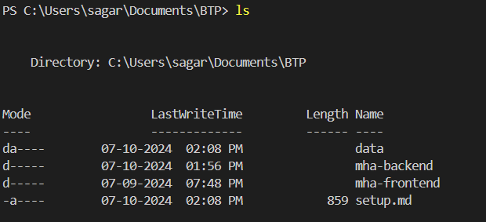
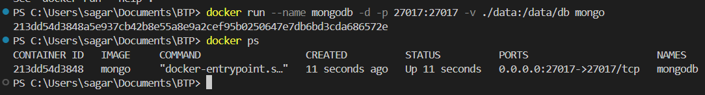

## Setting up the mongo db docker container

### Pull the mongo image from the docker hub 
```
docker pull mongo
```
<!-- the above command will pull the latest mongo images  -->

### Create a container and running 
Go to the project folder which has the mha-backend, mha-frontend and data folders



Run the below command to create the docker container and run it simultaniously
```
docker run --name mongodb -d -p 27017:27017 -v ./data:/data/db mongo

# docker run --name mongodb -d -p 27017:27017 -v .<location of data in host machine>\:/data/db mongo
```
- Here we are mounting the `data` folder with the `data/db` folder in the mongodb images

Container has been created and its running right now
  


- mongodb is the name of the container

Any changes related to the database will be reflected in the data folder in the host machine

### To start and stop the database container
command
```
docker start monogdb
#docker start <name of the container> 

docker stop mongodb 
#docker stop <name of the container>
```
